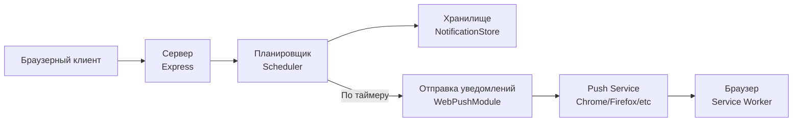

# Pushka — планировщик Web Push уведомлений


Принимает от клиента [Push Subscription](https://developer.mozilla.org/en-US/docs/Web/API/PushSubscription), `datetime` (_когда_ отправить) и `payload` (_что_ отправить). Сохраняет в хранилище и в нужный момент отправляет через Web Push Protocol.

**Демо:** [pushka.mvladt.ru](https://pushka.mvladt.ru) — встроенная страница-клиент: подписка на push и планирование тестового уведомления.

## Запуск

Требуется Node.js **≥ 24** (встроенный `node:sqlite`).

```sh
npm ci
npm start
```

При первом запуске `.env` создаётся автоматически с новыми VAPID-ключами. Кастомные значения (`PORT`, `VAPID_SUBJECT`) — отредактировать `.env`.

Через Docker:

```sh
docker compose up --build
```

## API

| Метод  | Путь                 | Описание                                                                                                        |
| ------ | -------------------- | --------------------------------------------------------------------------------------------------------------- |
| `GET`  | `/api/key`           | Публичный VAPID-ключ — нужен браузеру для получения Push Subscription                                            |
| `POST` | `/api/notifications` | Запланировать уведомление — в теле [NotificationEntity](https://github.com/mvladt/pushka/blob/main/src/types.ts) |
| `GET`  | `/api/health`        | Проверка живости                                                                                                 |

```sh
curl -X POST 'https://pushka.mvladt.ru/api/notifications' \
  -H 'Content-Type: application/json' \
  -d '{
    "id": "123",
    "datetime": "2026-01-01T12:00",
    "payload": {"text": "Hello"},
    "subscription": {
      "endpoint": "https://fcm.googleapis.com/fcm/send/...",
      "expirationTime": null,
      "keys": {"p256dh": "...", "auth": "..."}
    }
  }'
```

Полная спецификация — `specs/api/openapi.json`.

## Архитектура



## Разработка

```sh
npm run dev              # dev-сервер с watch-режимом
npm run test:env         # unit-тесты загрузки .env
npm run test:sqliteStore # unit-тесты SQLite-хранилища
npm run test:integration # интеграционные тесты
npm run test:playwright  # e2e-тесты (Playwright)
```

## Деплой

Прод — `pushka.mvladt.ru` (VPS, systemd). CI гоняет тесты на каждый push/PR, деплой запускается вручную: **Actions → Deploy → Run workflow**. Подробности — `deploy/README.md`.

---

_Демонстрационный проект, показывающий полный цикл работы с Web Push Notifications._
